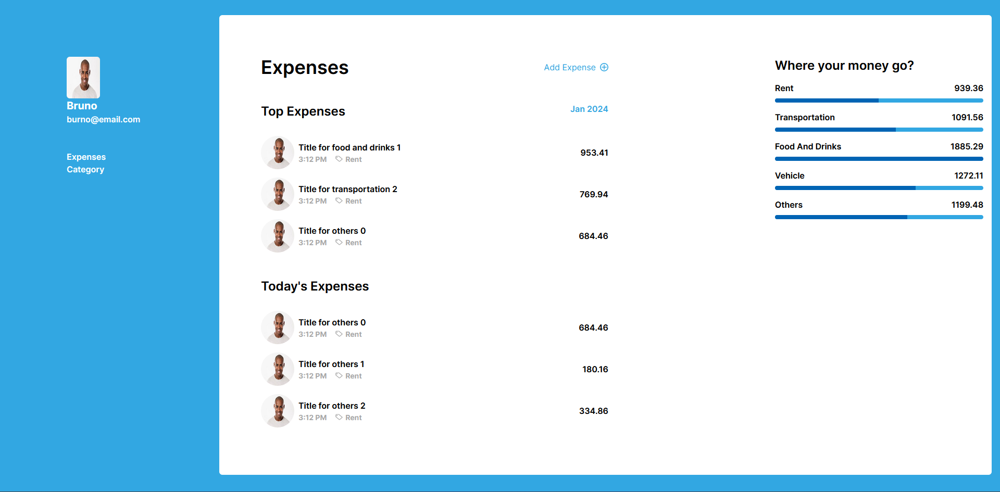
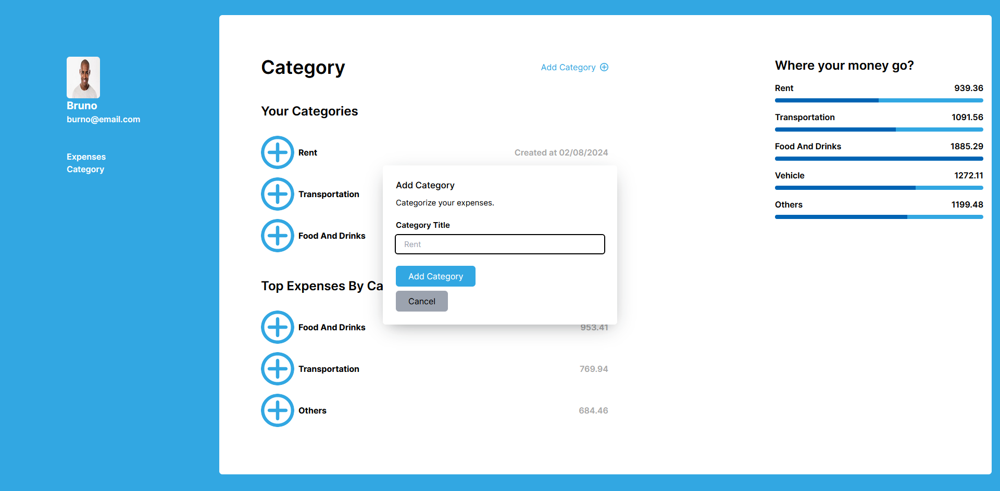

# [7DayExpense Tracker](https://7dayexpensetracker.vercel.app/). Track your expenses.

## 🏗 Installation

### 1. clone the repo

```sh
git clone https://github.com/rahulrajdahal/7dayexpensetracker.git
```

### 2. Install Dependencies

#### npm

```sh
cd 7dayexpensetracker && npm install
```

### 💾 Connect to Database

// schema.prisma

```sh
provider = "prisma-database-provider"
```

### 4. Update env

update the .env.example file to .env and append key value pairs.

### 5. Run development server

```sh
npm run dev
```

#### OR

### Run Production server

```sh
npm run start
```

## Preview

[](https://7dayexpensetracker.vercel.app/)


## 🚀 Project Structure

Inside of project [7DayExpense Tracker](https://7dayexpensetracker.vercel.app), you'll see the following folders and files:

```text
/
├── public/
│   └── favicon.svg
├── app/
|   ├── page/
│   │   ├── page.tsx
│   │   ├── layout.tsx
│   ├── page.tsx
│   └── layout.tsx
├── components/
│   ├── index.ts
│   └── Component
|       └── Component.tsx
|       └── Component.stories.ts
|       └── Component.cy.tsx
├── cypress/
│   ├── e2e
│   │   └── e2etest.cy.ts
│   ├── fixtures
│   └── support
├── hooks/
│   └── index.ts
├── utils/
│   ├── helpers.ts
└── package.json
```

## 🧞 Commands

All commands are run from the root of the project, from a terminal:

| Command               | Action                                        |
| :-------------------- | :-------------------------------------------- |
| `npm install`         | Installs dependencies.                        |
| `npm run dev`         | Starts local dev server at `localhost:3000`.  |
| `npm run build`       | Build your production site to `./next/`.      |
| `npm run start`       | Preview your build locally, before deploying. |
| `npm run lint`        | Check all linting errors.                     |
| `npm run postinstall` | Scripts to run after npm install.             |
